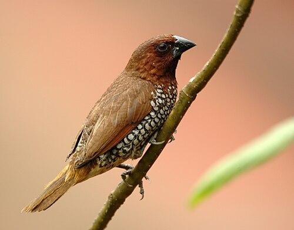

# The Munia Typeface family

Munia Dot is an LED dot-style font named after the bird Munia.



> Photo By <a href="//commons.wikimedia.org/wiki/User:Yathin_sk" title="User:Yathin sk">Yathin S Krishnappa</a> - <span class="int-own-work" lang="en">Own work</span>, <a href="https://creativecommons.org/licenses/by-sa/3.0" title="Creative Commons Attribution-Share Alike 3.0">CC BY-SA 3.0</a>, <a href="https://commons.wikimedia.org/w/index.php?curid=24848688">Link</a> (Wikipedia Article link: https://en.wikipedia.org/wiki/Scaly-breasted_munia)

The glyphs are created using the 2D graphics library [Chitra](https://chitra-2d.github.io) and then imported into the font file using the Python [FontForge](https://fontforge.org/en-US) script.

Munia Dot offers two styles: circle dots and square dots. By default,, it uses circle dots, and you can enable square dots using the `ss01` feature.

```css
.circle-dot {
    font-family: 'Munia Dot';
}
.square-dot {
    font-family: 'Munia Dot';
    font-feature-settings: 'ss01' 1;
}
```


**Note**: The font work is still in progress.
