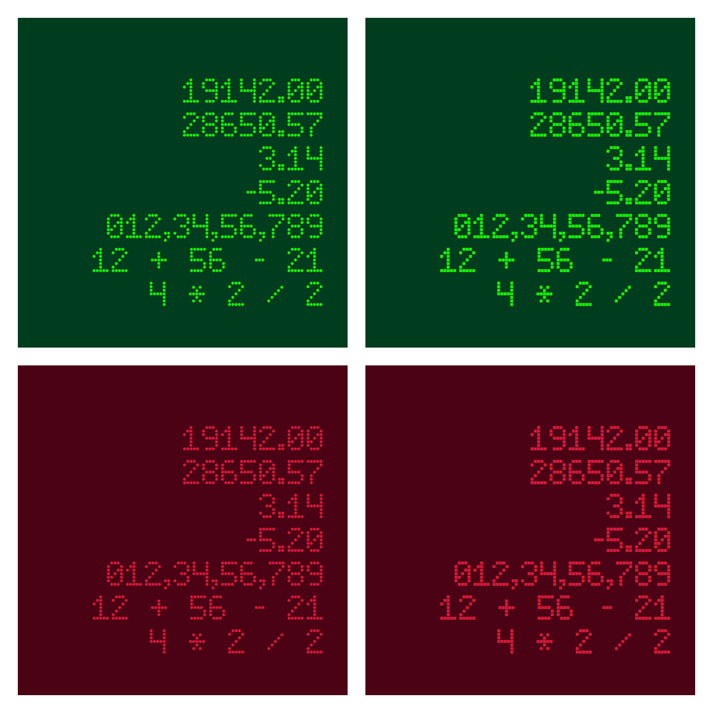

# The Munia Typeface family

Munia Dot is an LED dot-style font named after the bird Munia.

| .jpg/330px-Lonchura_punctulata_(Nagarhole%2C_2004).jpg) |
| :---: |
| From Wikipedia https://en.wikipedia.org/wiki/Scaly-breasted_munia |

The glyphs are created using the 2D graphics library [Chitra](https://chitra-2d.github.io) and then imported into the font file using the Python [FontForge](https://fontforge.org/en-US) script.

Munia Dot offers two styles: circle dots and square dots. By default,, it uses circle dots, and you can enable square dots using the `ss01` feature.

```css
.circle-dot {
    font-family: 'Munia Dot';
}
.square-dot {
    font-family: 'Munia Dot';
    font-feature-settings: 'ss01' 1;
}
```



**Note**: The font work is still in progress.
